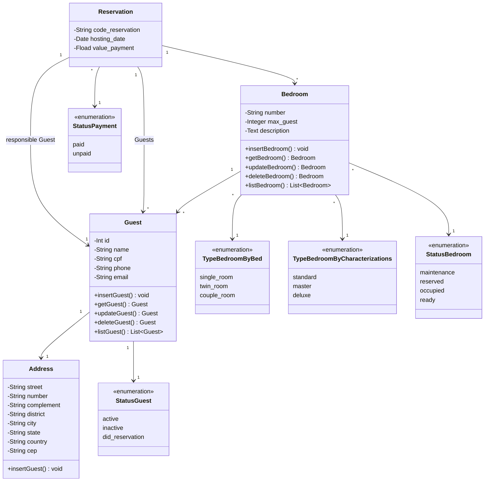

## Documento de Modelos

Neste documento temos o modelo Conceitual (UML) ou de Dados (Entidade-Relacionamento).

## Modelo Conceitual

```mermaid
classDiagram
    
    class Guest{
        -Int id
        -String name
        -String cpf
        -String phone
        -String email

        +insertGuest() void
        +getGuest() Guest
        +updateGuest() Guest
        +deleteGuest() Guest
        +listGuest() List~Guest~
    }
    
    class Address{
      -String street 
      -String number 
      -String complement   
      -String district 
      -String city 
      -String state 
      -String country 
      -String cep 
      
      +insertGuest() void
    }
    
    class StatusGuest{
      <<enumeration>>
      active
      inactive
      did_reservation
    }

    class Bedroom{
      -String number
      -Integer max_guest
      -Text description

      +insertBedroom() void
      +getBedroom() Bedroom
      +updateBedroom() Bedroom
      +deleteBedroom() Bedroom
      +listBedroom() List~Bedroom~
    }

    class TypeBedroomByBed{
      <<enumeration>>
      single_room
      twin_room
      couple_room
    }

    class TypeBedroomByCharacterizations{
      <<enumeration>>
      standard
      master
      deluxe
    }

    class StatusBedroom{
      <<enumeration>>
      maintenance
      reserved
      occupied
      ready
    }

    class Reservation{
      -String code_reservation
      -Date hosting_date
      -Fload value_payment
    }

    class StatusPayment{
      <<enumeration>>
      paid
      unpaid
    }
    
    Guest "1" --> "1" Address
    Guest "1" --> "1" StatusGuest
    
    Bedroom "*" --> "1" TypeBedroomByBed
    Bedroom "*" --> "1" TypeBedroomByCharacterizations
    Bedroom "*" --> "1" StatusBedroom
    Bedroom "1" --> "*" Guest

    Reservation "1" --> "*" Guest :Guests
    Reservation "1" --> "1" Guest :responsible Guest
    Reservation "1" --> "*" Bedroom
    Reservation "*" --> "1" StatusPayment


   

```
